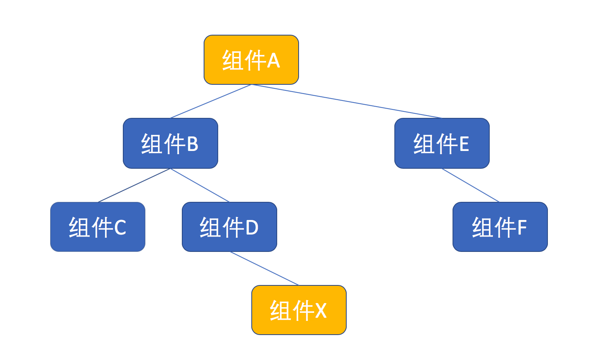

# React的设计思想

## 基础原则

### 1.界面由数据驱动

1. react界面完全由数据驱动

2. react中一切都是组件

3. props是react组件之间通讯方式

   > UI=f(data)

   UI 就是把 data 作为参数传递给 f 运算出来的结果。这个公式的含义就是，如果要渲染界面，不要直接去操纵 DOM 元素，而是修改数据，由数据去驱动 React 来修改界面。

   我们开发者要做的，就是设计出合理的数据模型，让我们的代码完全根据数据来描述界面应该画成什么样子，而不必纠结如何去操作浏览器中的 DOM 树结构。

   这样一种程序结构，是声明式编程（Declarative Programming）的方式，代码结构会更加容易理解和维护。

### 2.react世界中的一等公民是组件

在 JavaScript 的世界里，一切皆是对象，甚至连一个函数都是一个对象。

我们可以把一个函数当做对象来赋值给一个变量，可以把对象作为参数传递给一个函数，也可以访问一个函数的属性，函数完全就是一个对象。

比如，你是否知道，你可以访问一个函数的 length 来获知这个函数声明的参数？

```react
function foo(a, b) {
  return a + b;
}

console.log(foo.length); // 输出为2
```

在react中，一切皆为组件：

1. 用户界面就是组件；

   - 一个组件可以是类也可以是函数，取决于是否是有自己状态

   - 组件可以嵌套

   - 组件可以不render任何内容，单纯去获取数据

     ```react
     class Beacon extends React.Component {
       render() {
         return null;
       }
       
       componentDidMount() {
         const beacon = new Image();
         beacon.src = 'https://domain.name/beacon.gif';
       }
     }
     /*
     不过，Beacon 的 componentDidMount 函数中创造了一个 Image 对象，访问了一个特定的图片资源，这样就可以对应服务器上留下日志记录，用于记录这一次网页访问。
     Beacon 组件的使用方式和普通组件别无二致，但是却能够轻松实现对网页访问的跟踪。
     （unknow：这个part目前看的有点晦涩 后面再来理解）
     */
     ```

2. 组件可以嵌套包装组成复杂功能；

3. 组件可以用来实现副作用。

### 3.组件之间语言：props

一个父组件有话要对子组件说，也就是，想要传递数据给子组件，则应该通过 props。


当然，你可以给子组件增加一个新的函数，然后让父组件去调用这个函数，但是，这种方法很拙劣。如果直接调用子组件的函数，执行过程也处于 React 生命周期之外，所以，不应该使用这种方法。

同样，如果子组件有话要同父组件说，那应该支持函数类型的 props。身为 JavaScript 里一等公民的函数可以作为参数传递，当然也可以作为 props 传递。让父组件传递一个函数类型的 props 进来，当子组件要传递数据给父组件时，调用这个函数类型 props，就把信息传递给了父组件。

**如果两个完全没有关系的组件之间有话说，情况就复杂了一点，比如下图中，两个橙色组件之间如果有话说，就没法直接通过 props 来传递信息。**


一个比较土的方法，就是通过 props 之间的逐步传递，来把这两个组件关联起来。如果之间跨越两三层的关系，这种方法还凑合，但是，如果这两个组件隔了十几层，或者说所处位置多变，那让 props 跨越千山万水来相会，实在是得不偿失。

另一个简单的方式，就是建立一个全局的对象，两个组件把想要说的话都挂在这个全局对象上。这种方法当然简单可行，但是，我们都知道全局变量的危害罄竹难书，如果不想将来被难以维护的代码折磨，我们最好对这种方法敬而远之。

一般，业界对于这种场景，往往会采用第三方数据管理工具来解决，比如Redux 和 Mobx 

其实，不依赖于第三方工具，React 也提供了自己的跨组件通讯方式，这种方式叫 Context

> context

## 组件设计模式（1）：聪明/傻瓜组件

> 其他称呼
>
> 1. 容器组件和展示组件（Container and Presentational Components）；
> 2. 胖组件和瘦组件；
> 3. 有状态组件和无状态组件。

使用 React 来做界面，无外乎就是获得驱动界面的数据，然后利用这些数据来渲染界面。当然，你可以在一个组件中就搞定，但是，最好把获取和管理数据这件事和界面渲染这件事分开。做法就是，把获取和管理数据的逻辑放在父组件，也就是聪明组件；把渲染界面的逻辑放在子组件，也就是傻瓜组件。

这么做的好处，是可以灵活地修改数据状态管理方式，比如，最初你可能用 Redux 来管理数据，然后你想要修改为用 Mobx，如果按照这种模式分割组件，那么，你需要改的只有聪明组件，傻瓜组件可以保持原来样子

```react
import SmileFace from './yaoming_simile.png';

const Joke = ({value}) => {
  return (
    <div>
      
      {value || 'loading...' }
    </div>
  );
}
//-----------------------------------------------------------
export default class RandomJoke extends React.Component {
  state = {
    joke: null
  }

  render() {
    return <Joke value={this.state.joke} />
  }

  componentDidMount() {
    fetch('https://icanhazdadjoke.com/',
      {headers: {'Accept': 'application/json'}}
    ).then(response => {
      return response.json();
    }).then(json => {
      this.setState({joke: json.joke});
    });
  }
}
```

当 RandomJoke 被第一次渲染的时候，它的 state 中的 joke 值为 `null`，所以它传给 Joke 的 value 也是 `null`，这时候，Joke 会渲染一 “loading…”。但是，在第一次渲染完毕的时候，`componentDidMount` 被调用，一个 API 请求发出去，拿到一个随机笑话，更新 state 中的 joke 值。因为对一个组件 state 的更新会引发一个新的渲染过程，所以 RandomJoke 的 `render` 再一次被调用，所以 Joke 也会再一次被渲染，这一次，传入的 value 值是一个真正的笑话，所以，笑话也就出现了。


### 性能提升

#### pureComponent

傻瓜组件一般没有状态，可以像joke一样实现为函数形式。函数组件虽然占用小，不需要管理state，但无法利用shouldComponentUpdate，

> 这应该补充一下shouldComponentUpdated的作用，就是检查是否是需要更新，当传入的数据一样情况下不要去重新渲染
>
> 但其实react提供一个更简单的工具，那就是pureComponet

```react
//方法一：纯函数组件
const Joke = ({value}) => {
  return (
    <div>
      
      {value || 'loading...' }
    </div>
  );
}
//方法二：定义 shouldComponentUpdate 函数，
//方法三：purecomponent
class Joke extends React.PureComponent {
  render() {
    return (
      <div>
        
        {this.props.value || 'loading...' }
      </div>
    );
  }
}
/*
值得一提的是，PureComponent 中 shouldComponentUpdate 对 props 做得只是浅层比较，不是深层比较，如果 props 是一个深层对象，就容易产生问题。

比如，两次渲染传入的某个 props 都是同一个对象，但是对象中某个属性的值不同，这在 PureComponent 眼里，props 没有变化，不会重新渲染，但是这明显不是我们想要的结果。
*/
```

#### react.memo

> 虽然 PureComponent 可以提高组件渲染性能，但是它也不是没有代价的，它逼迫我们必须把组件实现为 class，不能用纯函数来实现组件。

如果你使用 React v16.6.0 之后的版本，可以使用一个新功能 `React.memo` 来完美实现 React 组件，上面的 Joke 组件可以这么写：

```react
const Joke = React.memo(() => (
    <div>
        
        {this.props.value || 'loading...' }
    </div>
));
```

React.memo 既利用了 shouldComponentUpdate，又不要求我们写一个 class，这也体现出 React 逐步向完全函数式编程前进。


## 组件设计模式（2）：高阶组件

组件是一等公民，我们一般是把共用逻辑提取成一个react组件，不过有时候共用逻辑没法单独使用，它们只是对其他组件的功能增强（hoc）

#### 高阶组件的基本形式

“高阶组件”名为“组件”，其实并不是一个组件，而是一个函数，只不过这个函数比较特殊，它接受至少一个 React 组件为参数，并且能够返回一个全新的 React 组件作为结果，当然，这个新产生的 React 组件是对作为参数的组件的包装，所以，有机会赋予新组件一些增强的“神力”。

一个最简单的高阶组件是这样的形式：

```
const withDoNothing = (Component) => {
  const NewComponent = (props) => {
    return <Component {...props} />;
  };
  return NewComponent;
};
```

上面的函数 `withDoNothing` 就是一个高阶组件，作为一项业界通用的代码规范，高阶组件的命名一般都带 `with` 前缀，命名中后面的部分代表这个高阶组件的功能。

就如同 withDoNothing 这个名字所说的一样，这个高阶组件什么都没做，但是从中可以看出高阶组件的基本代码套路。

1. 高阶组件不能去修改作为参数的组件，高阶组件必须是一个纯函数，不应该有任何副作用。
2. 高阶组件返回的结果必须是一个新的 React 组件，这个新的组件的 JSX 部分肯定会包含作为参数的组件。
3. 高阶组件一般需要把传给自己的 props 转手传递给作为参数的组件。

#### 用高阶组件抽取共同逻辑

接下来，我们对 withDoNothing 进行一些改进，让它实现“只有在登录时才显示”这个功能。

假设我们已经有一个函数 `getUserId` 能够从 cookies 中读取登录用户的 ID，如果用户未登录，这个 `getUserId` 就返回空，那么“退出登录按钮“就需要这么写：

```react
const LogoutButton = () => {
  if (getUserId()) {
    return ...; // 显示”退出登录“的JSX
  } else {
    return null;
  }
};
```

同样，购物车的代码就是这样：

```react
const ShoppintCart = () => {
  if (getUserId()) {
    return ...; // 显示”购物车“的JSX
  } else {
    return null;
  }
};
```

上面两个组件明显有重复的代码，我们可以把重复代码抽取出来，形成 `withLogin` 这个高阶组件，代码如下：

```react
const withLogin = (Component) => {
  const NewComponent = (props) => {
    if (getUserId()) {
      return <Component {...props} />;
    } else {
      return null;
    }
  }

  return NewComponent;
};
//抽取了共同逻辑
```

#### 高阶组件的高级用法

高阶组件只需返回一个组件，但可以接受多个组件作为参数。

比如，我可以改进withLogin，让它接受两个，工具是否登录去渲染合适组件

```react
const withLoginAndLogout = (ComponentForLogin, ComponentForLogout) => {
  const NewComponent = (props) => {
    if (getUserId()) {
      return <ComponentForLogin {...props} />;
    } else {
      return <ComponentForLogout{...props} />;
    }
  }
  return NewComponent;
};
```

有了上面的withLoginAndLogout，就可以产生不同状态的内容

```react
const TopButtons = withLoginAndLogout(
  LogoutButton,
  LoginButton
);
```

#### 链式调用高阶组件

高阶组件最巧妙的一点，是可以链式调用。

假设，你有三个高阶组件分别是 `withOne`、`withTwo` 和 `withThree`，那么，如果要赋予一个组件 X 某个高阶组件的超能力，那么，你要做的就是挨个使用高阶组件包装，代码如下：

```react
const X1 = withOne(X);
const X2 = withTwo(X1);
const X3 = withThree(X2);
const SuperX = X3; //最终的SuperX具备三个高阶组件的超能力
```

你如果不嫌恶心可以直接

```react
const SuperX = withThree(withTwo(withOne(X)));
```

对于 `X` 而言，它被高阶组件包装了，至于被一个高阶组件包装，还是被 N 个高阶组件包装，没有什么差别（把包装换成包养，你会有新的理解）。而高阶组件本身就是一个纯函数，纯函数是可以组合使用的，所以，我们其实可以把多个高阶组件组合为一个高阶组件，然后用这一个高阶组件去包装`X`，代码如下：

```react
const hoc = compose(withThree, withTwo, withOne);
const SuperX = hoc(X);
```

这个compose是函数式编程的一种基础写法，就是把多个函数组合成为一个函数，下面是一个参考实现

```react
export default function compose(...funcs) {
  if (funcs.length === 0) {
    return arg => arg
  }

  if (funcs.length === 1) {
    return funcs[0]
  }

  return funcs.reduce((a, b) => (...args) => a(b(...args)))
}
			
```

总结：react组件可以当积木一样用，假如一个应用中多个组件都需要同样的多个高阶组件包装，那就可以用 compose 组合这些高阶组件为一个高阶组件，这样在使用多个高阶组件的地方实际上就只需要使用一个高阶组件了。

#### 不要滥用高阶组件

高阶组件虽然可以用一种可重用的方式扩充现有 React 组件的功能，但高阶组件并不是绝对完美的。

首先，高阶组件不得不处理 `displayName`，不然 debug 会很痛苦。当 React 渲染出错的时候，靠组件的 displayName 静态属性来判断出错的组件类，而高阶组件总是创造一个新的 React 组件类，所以，每个高阶组件都需要处理一下 displayName。

如果要做一个最简单的什么增强功能都没有的高阶组件，也必须要写下面这样的代码：

```
const withExample = (Componenwt) => {
  const NewComponent = (props) => {
    return <Component {...props} />;
  }
  
  NewComponent.displayName = `withExample(${Component.displayName || Component.name || 'Component'})`;
  
  return NewCompoennt;
};
```

> 可能有人对组件的displayName有点懵逼，可以看下补充说明
>
> 1. `displayName` 字符串多用于调试消息。通常，你不需要设置它，因为它可以根据函数组件或 class 组件的名称推断出来。
>
> 2. 在高阶组件中，displayName用于调试
>
>    1. ```react
>       function withSubscription(WrappedComponent) {
>         class WithSubscription extends React.Component {/* ... */}
>         WithSubscription.displayName = `WithSubscription(${getDisplayName(WrappedComponent)})`;
>         return WithSubscription;
>       }
>       //这是react文档的用
>       function getDisplayName(WrappedComponent) {
>         return WrappedComponent.displayName || WrappedComponent.name || 'Component';
>       }
>       ```

每个高阶组件都这么写，就会非常的麻烦。

对于 React 生命周期函数，高阶组件不用怎么特殊处理，但是，如果内层组件包含定制的静态函数，这些静态函数的调用在 React 生命周期之外，那么高阶组件就必须要在新产生的组件中增加这些静态函数的支持，这更加麻烦。

其次，高阶组件支持嵌套调用，这是它的优势。但是如果真的一大长串高阶组件被应用的话，当组件出错，你看到的会是一个超深的 stack trace，十分痛苦。

最后，使用高阶组件，一定要非常小心，要避免重复产生 React 组件，比如，下面的代码是有问题的：

```react
const Example = () => {
  const EnhancedFoo = withExample(Foo);
  return <EnhancedFoo />
}
```

像上面这样写，每一次渲染 Example，都会用高阶组件产生一个新的组件，虽然都叫做 `EnhancedFoo`，但是对 React 来说是一个全新的东西，在重新渲染的时候不会重用之前的虚拟 DOM，会造成极大的浪费。

正确的写法是下面这样，自始至终只有一个 EnhancedFoo 组件类被创建：

```
const EnhancedFoo = withExample(Foo);

const Example = () => {
  return <EnhancedFoo />
}
```

总之，高阶组件是重用代码的一种方式，但并不是唯一方式  另外一种方式是render props

> 在这一小节中，高阶组件（HoC）这种重用逻辑的模式
>
> 1. 高阶组件的形式；
> 2. 高阶组件的链式调用方法；
> 3. 高阶组件的不足。

## 组件的设计模式（3):render prop模式

术语 [“render prop”](https://cdb.reacttraining.com/use-a-render-prop-50de598f11ce) 是指一种在 React 组件之间使用一个值为函数的 prop 共享代码的简单技术

具有 render prop 的组件接受一个返回 React 元素的函数，并在组件内部通过调用此函数来实现自己的渲染逻辑。

```
<DataProvider render={data => (
  <h1>Hello {data.target}</h1>
)}/>
```

使用 render prop 的库有 [React Router](https://reacttraining.com/react-router/web/api/Route/render-func)、[Downshift](https://github.com/paypal/downshift) 以及 [Formik](https://github.com/jaredpalmer/formik)。

在这个文档中，我们将讨论为什么 render prop 是有用的，以及如何写一个自己的 render prop 组件。

一个最简单的 render props 组件 `RenderAll`，代码如下：

```
const RenderAll = (props) => {
  return(
     <React.Fragment>
     	{props.children(props)}
     </React.Fragment>
  );
};
```

这个 `RenderAll` 预期子组件是一个函数，它所做的事情就是把子组件当做函数调用，调用参数就是传入的 props，然后把返回结果渲染出来，除此之外什么事情都没有做。

使用 RenderAll 的代码如下：

```
      <RenderAll>
        {() => <h1>hello world</h1>}
      </RenderAll>
```

可以看到，RenderAll 的子组件，也就是夹在 RenderAll 标签之间的部分，其实是一个函数。这个函数渲染出 `<h1>hello world</h1>`，这就是上面使用 RenderAll 渲染出来的结果。

当然，这个 RenderAll 没做任何实际工作，接下来我们看 render props 真正强悍的使用方法。

### 传递 props

和高阶组件一样，render props 可以做很多的定制功能，我们还是以根据是否登录状态来显示一些界面元素为例，来实现一个 render props。

下面是实现 render props 的 `Login` 组件，可以看到，render props 和高阶组件的第一个区别，就是 render props 是真正的 React 组件，而不是一个返回 React 组件的函数。

```
const Login = (props) => {
  const userName = getUserName();

  if (userName) {
    const allProps = {userName, ...props};
    return (
      <React.Fragment>
        {props.children(allProps)}
      </React.Fragment>
    );
  } else {
    return null;
  }
};
```

当用户处于登录状态，`getUserName` 返回当前用户名，否则返回空，然后我们根据这个结果决定是否渲染 `props.children` 返回的结果。

当然，render props 完全可以决定哪些 props 可以传递给 props.children，在 Login 中，我们把 `userName` 作为增加的 props 传递给下去，这样就是 Login 的增强功能。

一个使用上面 Login 的 JSX 代码示例如下：

```
  <Login>
    {({userName}) => <h1>Hello {userName}</h1>}
  </Login>
```

### 不局限于 children

在上面例子中这种模式称为“以函数为子组件（function as child）”的模式，这可以算是 render props 的一种具体形式，也就利用 `children` 这个 props 来作为函数传递。

实际上，render props 这个模式不必局限于 children 这一个 props，任何一个 props 都可以作为函数，也可以利用多个 props 来作为函数。

我们来扩展 Login，不光在用户登录时显示一些东西，也可以定制用户没有登录时显示的东西，我们把这个组件叫做 `Auth`，对应代码如下：

```
const Auth= (props) => {
  const userName = getUserName();

  if (userName) {
    const allProps = {userName, ...props};
    return (
      <React.Fragment>
        {props.login(allProps)}
      </React.Fragment>
    );
  } else {
    <React.Fragment>
      {props.nologin(props)}
    </React.Fragment>
  }
};
```

使用 Auth 的话，可以分别通过 `login` 和 `nologin` 两个 props 来指定用户登录或者没登录时显示什么，用法如下：

```
 <Auth
    login={({userName}) => <h1>Hello {userName}</h1>}
    nologin={() => <h1>Please login</h1>}
  />
 
```

### 依赖注入

render props 其实就是 React 世界中的“依赖注入”（Dependency Injection)。

所谓依赖注入，指的是解决这样一个问题：逻辑 A 依赖于逻辑 B，如果让 A 直接依赖于 B，当然可行，但是 A 就没法做得通用了。依赖注入就是把 B 的逻辑以函数形式传递给 A，A 和 B 之间只需要对这个函数接口达成一致就行，如此一来，再来一个逻辑 C，也可以用一样的方法重用逻辑 A。

在上面的代码示例中，`Login` 和 `Auth` 组件就是上面所说的逻辑 A，而传递给组件的函数类型 props，就是逻辑 B 和 C。

### render props 和高阶组件的比较

> 原文大多数内容来自于前端大佬Morgan
> 我本来想边抄边加入自己的思考
> 但发现他写的太好了
> 没什么好加入的（bushi）
>
> 看到那个Hoc和render props时候就懵逼起来
> 虽然都是组件复用的方式
>
> render prop是一个用于告知组件需要什么内容的函数prop
>
> hoc是一种复印组件的设计模式，参数为组件，返回值为新组建的函数
>
> 

我们来比对一下这两种重用 React 组件逻辑的模式。

首先，render props 模式的应用，就是做一个 React 组件，而高阶组件，虽然名为“组件”，其实只是一个产生 React 组件的函数。

render props 不像上一小节中介绍的高阶组件有那么多毛病，如果说 render props 有什么缺点，那就是 render props 不能像高阶组件那样链式调用，当然，这并不是一个致命缺点。

render props 相对于高阶组件还有一个显著优势，就是对于新增的 props 更加灵活。还是以登录状态为例，假如我们扩展 withLogin 的功能，让它给被包裹的组件传递用户名这个 props，代码如下：

```
const withLogin = (Component) => {
  const NewComponent = (props) => {
    const userName= getUserName();
    if (userName) {
      return <Component {...props} userName={userName}/>;
    } else {
      return null;
    }
  }

  return NewComponent;
};
```

这就要求被 withLogin 包住的组件要接受 `userName` 这个props。可是，假如有一个现成的 React 组件不接受 userName，却接受名为 `name` 的 props 作为用户名，这就麻烦了。我们就不能直接用 withLogin 包住这个 React 组件，还要再造一个组件来做 `userName` 到 `name` 的映射，十分费事。

//看不懂

对于应用 render props 的 Login，就不存在这个问题，接受 `name` 不接受 `userName` 是吗？这样写就好了：

```
<Login>
  {
    (props) => {
      const {userName} = props;
      
      return <TheComponent {...props} name={userName} />
    }
  }
</Login>
```

所以，当需要重用 React 组件的逻辑时，建议首先看这个功能是否可以抽象为一个简单的组件；如果行不通的话，考虑是否可以应用 render props 模式；再不行的话，才考虑应用高阶组件模式。

这并不表示高阶组件无用武之地，在后续章节，我们会对 render props 和高阶组件分别讲解具体的实例。 

其实要比较render props和hoc的优劣之类的   我们可以对照着代码看

- render Props


- Hocs


- 其实render和props可以结合起来用

```
// 如果你出于某种原因真的想要 HOC，那么你可以轻松实现
// 使用具有 render prop 的普通组件创建一个！
function withMouse(Component) {
  return class extends React.Component {
    render() {
      return (
        <Mouse render={mouse => (
          <Component {...this.props} mouse={mouse} />
        )}/>
      );
    }
  }
}
```

### 小结

在这一小节中，我们介绍了 render props 这种模式，也将 render props 和高阶组件两种模式进行了比较。

读者应该要明白:

1. render props 的形式；
2. render props 其实就是“依赖注入”；
3. 如何利用 render props 实现共享组件之间的逻辑。 


## 组件设计模式（4）:提供者模式

在react中，提供者模式对应的就是ContextApi，提供者模式在react应用的完善对应的就是ContextApi的完善

### 问题场景

在 React 中，props 是组件之间通讯的主要手段，但是，有一种场景单纯靠 props 来通讯是不恰当的，那就是两个组件之间间隔着多层其他组件，下面是一个简单的组件树示例图图：



在上图中，组件 A 需要传递信息给组件 X，如果通过 props 的话，那么从顶部的组件 A 开始，要把 props 传递给组件 B，然后组件 B 传递给组件 D，最后组件 D 再传递给组件 X。

其实组件 B 和组件 D 完全用不上这些 props，但是又被迫传递这些 props，这明显不合理，要知道组件树的结构会变化的，将来如果组件 B 和组件 D 之间再插入一层新的组件，这个组件也需要传递这个 props，这就麻烦无比。

可见，对于跨级的信息传递，我们需要一个更好的方法。

在 React 中，解决这个问题应用的就是“提供者模式”。

### 提供者模式

虽然这个模式叫做“提供者模式”，但是其实有两个角色，一个叫“提供者”（Provider），另一个叫“消费者”（Consumer），这两个角色都是 React 组件。其中“提供者”在组件树上居于比较靠上的位置，“消费者”处于靠下的位置。在上面的组件树中，组件 A 可以作为提供者，组件 X 就是消费者。

既然名为“提供者”，它可以提供一些信息，而且这些信息在它之下的所有组件，无论隔了多少层，都可以直接访问到，而不需要通过 props 层层传递。

避免 props 逐级传递，即是提供者的用途。

### 历史各版本的简单实现方式

- ### v16.3.0 之前的提供者模式

  - 提供者(ThemeProvider)

    ```react
    //要实现提供者模式，就要实现一个组件，不过组件要做两个处理
    //getChildContext 返回回上下文数据
    class ThemeProvider extends React.Component {
      getChildContext() {
        return {
          theme: this.props.value
            //在这个例子中只是返回一个value，但可以有更复杂的操作，比如去state或者其他数据源拿数据
        };
      }
    	render() {
        return (
          <React.Fragment>
            {this.props.children}
          </React.Fragment>
        );
      }
    }
    //PropTypes 是用于做类型检查的 或者直接用typescript就可以掠过这个步骤
    
    ThemeProvider.childContextTypes = {
      theme: PropTypes.object
    };
    ```

  - 消费者(Subject,Paragraph)

    ```react
    //组件实现方式
    class Subject extends React.Component {
      render() {
        const {mainColor} = this.context.theme;
        return (
          <h1 style={{color: mainColor}}>
            {this.props.children}
          </h1>
        );
      }
    }
    //必须增加 contextTypes 属性，必须和 ThemeProvider 的 childContextTypes 属性一致，不然，this.context 就不会得到任何值
    //不过为什么要这么麻烦，provider不是给过一个校验了嘛
    //Q：为什么要求“提供者”用 childContextTypes 定义一次上下文结构，又要求“消费者”再用 contextTypes 再重复定义一次呢？这不是很浪费吗？
    //A:React 这么要求，是考虑到“上下文”可能会嵌套，就是一个“提供者”套着另一个“提供者”，这时候，底层的消费者组件到底消费哪一个“提供者”呢？通过这种显示的方式指定。
    Subject.contextTypes = {
      theme: PropTypes.object
    }
    //函数实现方式
    const Paragraph = (props, context) => {
        //函数方式访问不到this，但第二个参数其实就是context
      const {textColor} = context.theme;
      return (
        <p style={{color: textColor}}>
          {props.children}
        </p>
      );
    };
    //也不要忘了设定 Paragraph 的 contextTypes，不然参数 context 也不会是上下文。
    Paragraph.contextTypes = {
      theme: PropTypes.object
    };
    ```

  - 生产者—>消费者

    ```react
    const Page=()=>(
    	<div>
        	<Subject>标题</Subject>
     		<Paragraph>
            	正文
            </Paragraph>
        </div>
    )
    //如果我们要定制样式主题，只需要
    <ThemeProvider value={{mainColor: 'green', textColor: 'red'}} >
        <Page />
    </ThemeProvider>
    ```

- **React v16.3.0之后的提供者模式**

到了 React v16.3.0 的时候，新的 Context API 出来了，这套 API 毫不掩饰自己就是“提供者模式”的实现，命名上就带 “Provider” 和 “Consumer”。

```react
//还是上面的样式主题的例子，首先，要用新提供的 createContext 函数创造一个“上下文”对象。
const ThemeContext = React.createContext();
//这个对象有两个属性
const ThemeProvider = ThemeContext.Provider;
const ThemeConsumer = ThemeContext.Consumer;
//创造“提供者”极大简化了，都不需要我们创造一个 React 组件类。
//使用“消费者”也同样简单，而且应用了上一节我们介绍的 render props 模式，比如，Subject 的代码如下:
class Subject extends React.Component {
  render() {
    return (
      <ThemeConsumer>
        {
          (theme) => (
            <h1 style={{color: theme.mainColor}}>
              {this.props.children}
            </h1>
          )
        }
      </ThemeConsumer>
    );
  }
}
//上面的 ThemeConsumer 其实就是一个应用了 render props 模式的组件，它要求子组件是一个函数，会把“上下文”的数据作为参数传递给这个函数，而这个函数里就可以通过参数访问“上下文”对象。
//在新的 API 里，不需要设定组件的 childContextTypes 或者 contextTypes 属性，这省了不少事。
//可以注意到，Subject 没有自己的状态，没必要实现为类，我们用纯函数的形式实现 Paragraph，代码如下：
const Paragraph = (props, context) => {
  return (
    <ThemeConsumer>
      {
        (theme) => (
          <p style={{color: theme.textColor}}>
            {props.children}
          </p>
          )
      }
    </ThemeConsumer>
  );
};
//最后的使用部分没有变化
  <ThemeProvider value={{mainColor: 'green', textColor: 'red'}} >
    <Page />
  </ThemeProvider>
```

在老版 Context API 中，“上下文”只是一个概念，并不对应一个代码，两个组件之间达成一个协议，就诞生了“上下文”。

在新版 Context API 中，需要一个“上下文”对象（上面的例子中就是 `ThemeContext`)，使用“提供者”的代码和“消费者”的代码往往分布在不同的代码文件中，那么，这个 `ThemeContext` 对象放在哪个代码文件中呢？

最好是放在一个独立的文件中，这么一来，就多出一个代码文件，而且所有和这个“上下文”相关的代码，都要依赖于这个“上下文”代码文件，虽然这没什么大不了的，但是的确多了一层依赖关系。

为了避免依赖关系复杂，每个应用都不要滥用“上下文”，应该限制“上下文”的使用个数。

### 对于contextAPI

### 小结

这一小节我们介绍了“提供者模式”，读者应该能够理解：

1. 提供者模式解决的问题；
2. React 的 Context 功能对这种模式有很直接的支持；
3. 提供者模式中 render props 的应用。

在接下来关于 Redux 和 Mobx 的介绍中，可以看到“提供者模式”更广泛的应用。

