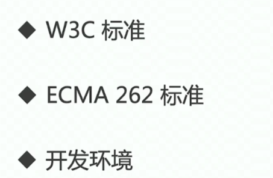
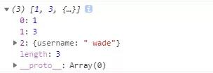
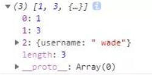

## 0.准备面试


### 知识体系

高效学习三部曲：找准知识体系；刻意训练；及时反馈

知识体系：结构化的知识范围

覆盖知识点；结构化；有组织；易拓展

### 哪些方面来梳理



## 1.react setState是同步还是异步

### React的工作机制

看下例子

```
state={
	number：1
}
componentDidMout(){
	this.setState({number:3})
	console.log(this.state.number)
}
```

看完这个例子，也许很多小伙伴会下意识的以为setState是一个异步方法，但是其实setState并没有异步的说法，之所以会有一种异步方法的表现形式，归根结底还是因为react框架本身的性能机制所导致的。因为每次调用setState都会触发更新，异步操作是为了提高性能，将多个状态合并一起更新，减少re-render调用。

试想一下如果在组件中有以下这样一段代码执行：

```text
for ( let i = 0; i < 100; i++ ) {
    this.setState( { num: this.state.num + 1 } );
}
```

>  React会将多个setState的调用合并为一个来执行，也就是说，当执行setState的时候，state中的数据并不会马上更新

如果是在实际开发中，我们要同步的获取倒更新之后的数据，那怎么获取呢？看下文档：

`setState()` 并不总是立即更新组件。它会批量推迟更新。这使得在调用 `setState()` 后立即读取 `this.state` 成为了隐患。为了消除隐患，请使用 `componentDidUpdate` 或者 `setState` 的回调函数（`setState(updater, callback)`），这两种方式都可以保证在应用更新后触发。如需基于之前的 state 来设置当前的 state，请阅读下述关于参数 `updater` 的内容。

除非 `shouldComponentUpdate()` 返回 `false`，否则 `setState()` 将始终执行重新渲染操作。如果可变对象被使用，且无法在 `shouldComponentUpdate()` 中实现条件渲染，那么仅在新旧状态不一时调用 `setState()`可以避免不必要的重新渲染。

### 可能的拓展

1. 小程序的setData的数据改变是同步，渲染是异步的
   `setData` 是小程序开发中使用最频繁的接口，也是最容易引发性能问题的接口。在介绍常见的错误用法前，先简单介绍一下 `setData` 背后的工作原理。工作原理

   小程序的视图层目前使用 WebView 作为渲染载体，而逻辑层是由独立的 JavascriptCore 作为运行环境。在架构上，WebView 和 JavascriptCore 都是独立的模块，并不具备数据直接共享的通道。当前，视图层和逻辑层的数据传输，实际上通过两边提供的 `evaluateJavascript` 所实现。即用户传输的数据，需要将其转换为字符串形式传递，同时把转换后的数据内容拼接成一份 JS 脚本，再通过执行 JS 脚本的形式传递到两边独立环境。

   而 `evaluateJavascript` 的执行会受很多方面的影响，数据到达视图层并不是实时的。

2. 

## 2.Vue的生命周期


1. 在 `beforeCreate` 钩子函数调用的时候，是获取不到 `props` 或者 `data` 中的数据的，因为这些数据的初始化都在 `initState` 中。
2. 然后会执行 `created` 钩子函数，在这一步的时候已经可以访问到之前不能访问到的数据，但是这时候组件还没被挂载，所以是看不到的。
3. 接下来会先执行 `beforeMount` 钩子函数，开始创建 VDOM，最后执行 `mounted` 钩子，并将 VDOM 渲染为真实 DOM 并且渲染数据。组件中如果有子组件的话，会递归挂载子组件，只有当所有子组件全部挂载完毕，才会执行根组件的挂载钩子。
4. 接下来是数据更新时会调用的钩子函数 `beforeUpdate` 和 `updated`，这两个钩子函数没什么好说的，就是分别在数据更新前和更新后会调用。
5. 另外还有 `keep-alive` 独有的生命周期，分别为 `activated` 和 `deactivated` 。用 `keep-alive` 包裹的组件在切换时不会进行销毁，而是缓存到内存中并执行 `deactivated` 钩子函数，命中缓存渲染后会执行 `actived` 钩子函数。（用过但不知道具体）

## 3.Vue组件通信

组件通信一般分为以下几种情况：

- 父子组件通信
- 兄弟组件通信
- 跨多层级组件通信
- 任意组件

### 父子

父组件通过props传递给子组件，子组件emit发送事件传递数据给组件

这种父子通信方式也就是典型的单向数据流，父组件通过 `props` 传递数据，子组件不能直接修改 `props`， 而是必须通过发送事件的方式告知父组件修改数据。（其实就是子组件调用父组件方法修改数据

另外这两种方法还可以用语法糖v-model来直接实现，因为 `v-model` 默认会解析成名为 `value` 的 `prop` 和名为 `input` 的事件。这种语法糖的方式是典型的双向绑定，常用于 UI 控件上，但是究其根本，还是通过事件的方法让父组件修改数据。

当然我们还可以通过访问 `$parent` 或者 `$children` 对象来访问组件实例中的方法和数据。

### 兄弟

对于这种情况可以通过查找父组件中的子组件实现，也就是 `this.$parent.$children`，在 `$children` 中可以通过组件 `name` 查询到需要的组件实例，然后进行通信。

### 跨多层组件通信

其实可以用 API provide/inject，虽然文档中不推荐直接使用在业务中，但是如果用得好的话还是很有用的。

这种模式和React的很像

假设有父组件 A，然后有一个跨多层级的子组件 B

```
// 父组件 A
export default {
  provide: {
    data: 1
  }
}
// 子组件 B
export default {
//就近原则，如果里面有多层provide  会覆盖
  inject: ['data'],
  mounted() {
    // 无论跨几层都能获得父组件的 data 属性
    console.log(this.data) // => 1
  }
}
```

### 任意组件

这种方式可以通过 Vuex 或者 Event Bus 解决，另外如果你不怕麻烦的话，可以使用这种方式解决上述所有的通信情况

（Event Bus ：store的事件触发器被移除，详细看文档

```
store 实例不再暴露事件触发器 (event emitter) 接口 (on、off、emit)。如果你之前使用 store 作为全局的 event bus，迁移说明相关内容请查阅此章节。

为了替换正在使用观察 store 自身触发事件的这些接口，(例如：store.on('mutation', callback))，我们引入新的方法 store.subscribe。在插件中的典型使用方式如下：

var myPlugin = store => {
  store.subscribe(function (mutation, state) {
    // Do something...
  })
}
```

## 3.解释一下原型链

 简单的回顾一下构造函数、原型和实例的关系：每个构造函数都有一个原型对象，原型对象都包含一个指向构造函数的指针，而实例都包含一个指向原型对象的内部指针。那么假如我们让原型对象等于另一个类型的实例，结果会怎样？显然，此时的原型对象将包含一个指向另一个原型的指针，相应地，另一个原型中也包含着一个指向另一个构造函数的指针。假如另一个原型又是另一个类型的实例，那么上述关系依然成立。如此层层递进，就构成了实例与原型的链条。这就是所谓的原型链的基本概念。——摘自《javascript高级程序设计》

### 原型是啥？原型的功能

每一个对象都有原型，有原型链查找的功能：原型上定义的属性的方法；自己能打点调用

构造函数的prototype将成为它new出来的实例的原型

原型的功能就是把所有类的函数（方法）写到原型prototype上，这样节约内存，所有实例共用函数

建议直接给面试管画（涩）图

### 对原型链的理解

· 在js里，继承机制是原型继承。继承的起点是 对象的原型（Object prototype）。

· 一切皆为对象，只要是对象，就会有 proto 属性，该属性存储了指向其构造的指针。

· Object prototype也是对象，其 proto 指向null。

· 对象分为两种：函数对象和普通对象，只有函数对象拥有『原型』对象（prototype）。

· prototype的本质是普通对象。

· Function prototype比较特殊，是没有prototype的函数对象。

· new操作得到的对象是普通对象。

· 当调取一个对象的属性时，会先在本身查找，若无，就根据 proto 找到构造原型，若无，继续往上找。最后会到达顶层Object prototype，它的 proto 指向null，均无结果则返回undefined，结束。

· 由 proto 串起的路径就是『原型链』。

· 通过prototype可以给所有子类共享属性

· 函数（Function）才有prototype属性，对象（除Object）拥有***\*proto\**** 

· 实例的***\*proto\****等于构造函数的prototype

· 实例的constructor指向构造函数

### 可以用proto改原型

```
var obj = {
	m: 444
};
var o = {
};
o.__proto__ = obj;//{m:444}
```

### 构造器设置原型：

```
function A(){
}
A.prototype.mm=66
var aaa=new A()
```

### Object.create()

```
var ooo={
 m:444
}
var o=Object.create(ooo) // 以ooo为原型创建东西
console.log(o.__proto__ === ooo);			//true
```

### 写一个原型链继承的例子


### 对原型链的理解？prototype上都有哪些属性

## 4.闭包

闭包就是函数能够记忆住当初定义时候的作用域，不管函数到哪里执行了，永远都能够记住那个作用域，并且会遮蔽新作用域的变量。

```
function fun(){
	var a = 10;
	return function(){
		console.log(a);
	}
}
var a = 20;
var f = fun();
f();			// 10
```

作用① ：可预测状态容器。

```
function fun(){
	var a = 10;
	return {
		add(){
			a ++;
		},
		minus(){
			a--;
		},
		getA(){
			return a;
		}
	}
}
```

作用② 实现模块化，实现变量的私有封装。

作用③ 可以实现迭代器。

```
fun();		//1
fun();		//2
fun();		//3 
function ooo(){
	var a = 0;
	return fun(){
		a++;
		console.log(a);
	}
}
```

## 5.深浅拷贝

### 浅拷贝

- 浅拷贝是创建一个新对象，这个对象有着原始对象属性值的一份精确拷贝。如果属性是基本类型，拷贝的就是基本类型的值，如果属性是引用类型，拷贝的就是内存地址 ，所以**如果其中一个对象改变了这个地址，就会影响到另一个对象**。

  ### Object.assign()

  ```
  //Object.assign()是浅拷贝，拷贝的是对象的属性引用而不是对象本身
  //object只有一层的时候，是浅拷贝
  Object.assigin({},obj)
  ```

  ### Array.prototype.concat()

  ```
  let arr = [1, 3, {    username: 'kobe'    }];
  let arr2=arr.concat();    
  arr2[2].username = 'wade';
  console.log(arr);
  ```

  

  ### Array.prototype.slice()

  ```
  let arr = [1, 3, {    username: ' kobe'    }];
  let arr3 = arr.slice();
  arr3[2].username = 'wade'
  console.log(arr);
  ```



**关于Array的slice和concat方法的补充说明**：Array的slice和concat方法不修改原数组，只会返回一个浅复制了原数组中的元素的一个新数组。

### 深拷贝

深拷贝是将一个对象从内存中完整的拷贝一份出来,从堆内存中开辟一个新的区域存放新对象,且**修改新对象不会影响原对象**。

JSON.parse(JSON.stringify())

​	原理： 用JSON.stringify将对象转成JSON字符串，再用JSON.parse()把字符串解析成对象，一去一来，新的对象产生了，而且对象会开	辟新的栈，实现深拷贝。

​	**这种方法虽然可以实现数组或对象深拷贝，但不能处理函数。**

手写递归方法

​	 深度克隆原理：**遍历对象，数组直到里边都是基本数据类型，然后复制，就是深度拷贝**

```
//定义检测数据类型的功能函数 完美精准 的返回各种数据类型
function checkedType(target){
	return Object.prototype.toString.call(target)
}
//实现深度克隆 ---对象/数组
//----------------------
function deepclone1(obj) {
  var objclone = Array.isArray(obj) ? [] : {}
  if (obj && typeof obj === 'object') {
    for (key in obj) {
      if (obj.hasOwnProperty(key)) {
        //typeof 在array时候也会返回应该object
        if (obj[key] && typeof obj[key] === 'object') {
          objclone = deepclone1(obj[key])
        } else {
          objclone = obj[key]
        }
      }
    }
  }
  return objclone
}
```


## 6.call,bind,apply

三个东西都是用来定义上下文的，call、apply会以指定上下文执行函数；而bind终身定死上下文但是不执行函数，返回新的函数。

其中call和apply传入参数的形式有别，call是单独罗列，逗号隔开参数；apply是数组。

​		函数.call(上下文对象，参数，参数，参数);

​		函数.apply(上下文对象，[参数，参数，参数]);

​	bind是ES6中新的方法， 可以终身绑死上下文，今后函数将不能用任何方法更改上下文。bind不会执行函数。

​	ES6中有了...运算符，call和apply区别也就不大了。

```
var obj = {
	a: 10
}

function fun(b, c){
	console.log(this.a + b + c);
}

fun.call(obj, 3, 4);
fun.apply(obj, [3, 4]);

fun = fun.bind(obj);		// 返回新的函数
fun(3,4);
```

## 7.变量类型和计算

### 0.值类型和引用类型

- 值类型

  

- 引用类型


### 1.typeof和instanceof

  两个api其实有点像是互补的

1. typeof在对值类型number、string、boolean 、null 、 undefined、 function的反应是精准的；
2. 对于对象{ } 、数组[ ] 、null 都会返回 object
3. 用 `instanceof` 判断一个实例是否属于某种类型
4. `instanceof` 运算符只能用于对象，不能用于原始类型的值

### 2.===和==

## 8.页面加载过程

## 9.Promise手写

## 10.原型

## 11.async/await

## 12.Generator的优势

## 13.什么是闭包

## 14.JS作用域

## 15.性能，体验优化

### 1.节流

### 2.防抖

## 16.JS异步

## 17.排序

- 冒泡排序

  ```
  const arr = [16, 31, 12, 1, 23, 888, 10]
  
  function bubbleSort(arr) {
    for (let i = 0; i < arr.length - 1; i++) {
      for (let j = 0; j < arr.length - i - 1; j++) {
        if (arr[j] > arr[j + 1]) {
          //es6 结构赋值
          [arr[j], arr[j + 1]] = [arr[j + 1], arr[j]]
        }
      }
      return arr
    }
  }
  ```

- 快速排序

  ```
  const arr = [16, 31, 12, 1, 23, 888, 10]
  
  function quickSort(arr) {
    if (arr.length <= 1) {
      return arr
    }
    const middleIndex = Math.floor(arr, arr.length / 2)
    const middleValue = arr.splice(middleIndex, 1)
    const left = []
    const right = []
    arr.foreach(v => {
      if (v < middle[0])
        left.push(v)
      else right.push(v)
    })
    return quickSort(left).concat(middleValue, quickSort(right))
  }
  ```

- 阴招

  ```
  //从小到大
  arr.sort((a,b)=>a-b)
  //从大到小
  arr.sort((a,b)=>b-a)
  ```

## 18.去重

```
//ES6
function uniqueArray(arr) {
  return [...new Set(arr)]
}
//ES5
function uniqueArray(arr){
	return arr.filter((v,i)=>arr.index(v)===i)
}
```

## 19.数组方法 reduce

对数组的每个元素执行一个你提供的reducer函数（升序），将其结果汇总为单个返回

```
arr.reducer((a,b)=>a+b)
```

## 20.浏览器

### session，token和cookie	

1. cookie是解决浏览器识别问题的，服务器会在HTTP的响应头部设置Set-Cookie字段， 浏览器今后每一次都会在HTTP请求头部带着cookie上去。cookie曾经充当过本地存储，比如我们公司之前做了一个换肤效果，就是用cookie存储的。cookie不安全，容易修改，存储量小。一般是用来放账号密码，保证长时间不掉线
2. session利用了cookie，不发明文了，而是密文，服务器做信息缓存，更安全。localStorage、sessionStorage是HTML5新增的本地存储。
3. token是利用用户特征（IP地址）进行的MD5校验码。

## 21.冒泡和捕获

W3C规定，事件先从外层到里层，再从内层到外层，方便不同业务使用，使用addEventListener('click',function(){}, true)，第三个参数true表示捕获，false表示冒泡，onclick是冒泡，我们经常是用事件冒泡做事件委托

捕获也有用，比如按住ctrl 点击才有用


## 22.一次完整HTTP请求的七个步骤

HTTP通信机制是在一次完整的HTTP通信过程中，Web浏览器与Web服务器之间将完成下列7个步骤：

***\*1. 建立TCP连接\****

在HTTP工作开始之前，Web浏览器首先要通过网络与Web服务器建立连接，该连接是通过TCP来完成的，该协议与IP协议共同构建Internet，即著名的TCP/IP协议族，因此Internet又被称作是TCP/IP网络。HTTP是比TCP更高层次的应用层协议，根据规则，只有低层协议建立之后才能，才能进行更层协议的连接，因此，首先要建立TCP连接，一般TCP连接的端口号是80。

***\*2. Web浏览器向Web服务器发送请求命令\**** 

一旦建立了TCP连接，Web浏览器就会向Web服务器发送请求命令。例如：GET/sample/hello.jsp HTTP/1.1。

***\*3. Web浏览器发送请求头信息\**** 

浏览器发送其请求命令之后，还要以头信息的形式向Web服务器发送一些别的信息，之后浏览器发送了一空白行来通知服务器，它已经结束了该头信息的发送。 

***\*4. Web服务器应答\**** 

客户机向服务器发出请求后，服务器会客户机回送应答， HTTP/1.1 200 OK ，应答的第一部分是协议的版本号和应答状态码。

***\*5. eb服务器发送应答头信息\**** 

正如客户端会随同请求发送关于自身的信息一样，服务器也会随同应答向用户发送关于它自己的数据及被请求的文档。 

***\*6. Web服务器向浏览器发送数据\**** 

Web服务器向浏览器发送头信息后，它会发送一个空白行来表示头信息的发送到此为结束，接着，它就以Content-Type应答头信息所描述的格式发送用户所请求的实际数据。

***\*7. Web服务器关闭TCP连接\**** 

一般情况下，一旦Web服务器向浏览器发送了请求数据，它就要关闭TCP连接，然后如果浏览器或者服务器在其头信息加入了这行代码：

Connection:keep-alive 

TCP连接在发送后将仍然保持打开状态，于是，浏览器可以继续通过相同的连接发送请求。保持连接节省了为每个请求建立新连接所需的时间，还节约了网络带宽。

## 13**.** 箭头函数和普通函数的区别

1）箭头函数的this是定义时决定的，普通函数是看调用方法。

2）箭头函数不能成为构造函数

3）箭头函数不能使用async/await

4）箭头函数不能加星

## 14.JS异步

Promise是ES6新增的处理异步的东西，叫做“承诺”。

Promise的实例有三种状态***\*：pending（进行中）、resolved（成功）、rejected（失败）\****

Promise对象有then方法，用来做resolved的事情。

Promise对象有catch方法，用来做rejected的事情。

 

回答层次维度：

***\*① 用途：回调黑洞的避免（最基本的使用）\****

传统异步函数，必须传入回调函数。

```
function addAfter2000ms(a, b, callback){
	setTimeout(function(){
		callback(a + b);
	}, 2000);
}

addAfter2000ms(3, 4, function(result){
	console.log(result);
});
```

有了Promise之后，就这么封装一下：

function addAfter2000ms(a, b){

```
function addAfter2000ms(a, b){
	return new Promise((resolve) => {
		setTimeout(function(){
			resolve(a + b);
		}, 2000);
	});
}

addAfter2000ms(3, 4).then(result => {
	console.log(result);
});
```

 

addAfter2000ms(3, 4).***\*then\****(result => {

​	console.log(result);

});

连续.then().then()没有回调黑洞了，变成了火车黑洞。

 

***\*② 它的小伙伴async/await\****

小伙伴有async/await，它能够等异步执行完毕，再执行后面的语句。

它能够让我们以写同步的方法写异步：

```
function addAfter2000ms(a, b){
	return new Promise((resolve) => {
		setTimeout(function(){
			resolve(a + b);
		}, 2000);
	});
}

async function main(){
	const result = await addAfter2000ms(3,4).then(data => data);
	console.log(result);
}

main();
```

让我们用写同步的形式写异步函数。

 

***\*③ 它和Generator的结合。\****

Generator（加星函数、产生器），产生器是产生啥的：迭代器。

```
function addAfter2000ms(a, b){
	return new Promise((resolve) => {
		setTimeout(() => {
			resolve(a + b);
		}, 2000);
	});
}

function* gen(){
	yield addAfter2000ms(3, 4);
	yield 'B';
	yield 'C';
	yield 'D';
};

var i = gen();

i.next().value.then(result => {
	console.log(result);
	console.log(i.next());
	console.log(i.next());
	console.log(i.next());
	console.log(i.next());
	console.log(i.next());
	console.log(i.next());
});
```

***\*④ 关于方便处理异步的错误\****

try{}catch(){}可以捕获异步的错误了。

```
async function main(){
	try{
		const result = await addAfter2000ms(3, 4).then(data => data.data);
		console.log(result);
	}catch(e){
		console.log("有错误");
		console.log(e);
	}
}
```

原来的异步，不能用try{  }catch(){  }：

```
try{
	setTimeout(function(){
		alert(m);
	}, 2000);
}catch(e){
	alert('补货到了错误');
}
```

then()里面有两个函数：

.then(fn1, fn2)

fn2就是处理错误的，它和.catch()的有啥区别？

fn2是我们能够预料到的某种服务器的错误，比如超时、服务器没有返回值等等；

.catch()是语法错误、可以throw的错误。