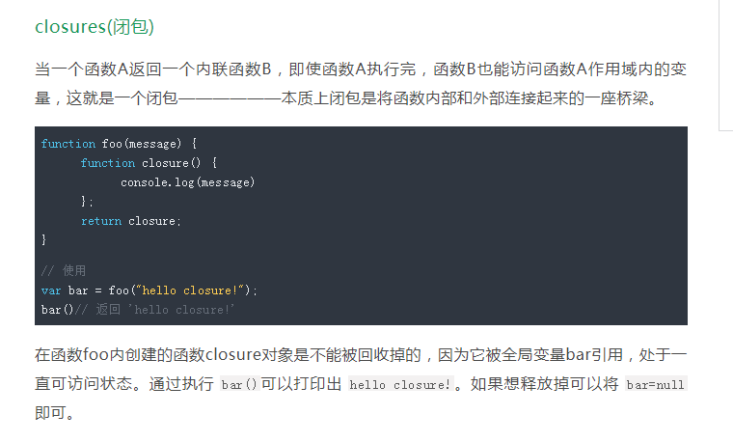
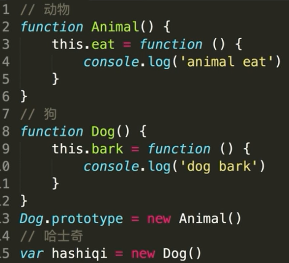

# JavaScript基础

## 数据基本类型

### 1.浅拷贝

- 浅拷贝是创建一个新对象，这个对象有着原始对象属性值的一份精确拷贝。如果属性是基本类型，拷贝的就是基本类型的值，如果属性是引用类型，拷贝的就是内存地址 ，所以**如果其中一个对象改变了这个地址，就会影响到另一个对象**。

  ### Object.assign()

  ```
  //Object.assign()是浅拷贝，拷贝的是对象的属性引用而不是对象本身
  //object只有一层的时候，是浅拷贝
  Object.assigin({},obj)
  ```

  ### Array.prototype.concat()

  ```
  let arr = [1, 3, {    username: 'kobe'    }];
  let arr2=arr.concat();    
  arr2[2].username = 'wade';
  console.log(arr);
  ```

  

  ### Array.prototype.slice()

  ```
  let arr = [1, 3, {    username: ' kobe'    }];
  let arr3 = arr.slice();
  arr3[2].username = 'wade'
  console.log(arr);
  ```


**关于Array的slice和concat方法的补充说明**：Array的slice和concat方法不修改原数组，只会返回一个浅复制了原数组中的元素的一个新数组。

### 2.深拷贝

深拷贝是将一个对象从内存中完整的拷贝一份出来,从堆内存中开辟一个新的区域存放新对象,且**修改新对象不会影响原对象**。

JSON.parse(JSON.stringify())

​	原理： 用JSON.stringify将对象转成JSON字符串，再用JSON.parse()把字符串解析成对象，一去一来，新的对象产生了，而且对象会开	辟新的栈，实现深拷贝。

​	**这种方法虽然可以实现数组或对象深拷贝，但不能处理函数。**

手写递归方法

​	 深度克隆原理：**遍历对象，数组直到里边都是基本数据类型，然后复制，就是深度拷贝**

```
//定义检测数据类型的功能函数 完美精准 的返回各种数据类型
function checkedType(target){
	return Object.prototype.toString.call(target)
}
//实现深度克隆 ---对象/数组
//----------------------
function deepclone1(obj) {
  var objclone = Array.isArray(obj) ? [] : {}
  if (obj && typeof obj === 'object') {
    for (key in obj) {
      if (obj.hasOwnProperty(key)) {
        //typeof 在array时候也会返回应该object
        if (obj[key] && typeof obj[key] === 'object') {
          objclone = deepclone1(obj[key])
        } else {
          objclone = obj[key]
        }
      }
    }
  }
  return objclone
}
//---实现克隆方法二

const deepclone = (o) => {
    if (Array.isArray(o)) {
        var arr = [];
        o.forEach(item => {
            arr.push(deepclone(item));
        });
        return arr;
    } else if (typeof o === "object") {
        var oo = {};
        for (var k in o) {
            oo[k] = deepclone(o[k]);
        }
        return oo;
    }
    return o;
}
console.log(deepclone(test));
```


## 作用域

### 	1.bind

​	

```
		函数.call(上下文对象，参数，参数，参数);
		函数.apply(上下文对象，[参数，参数，参数]);
```


### 	2.call和apply

```
var obj = {
	a: 10
}

function fun(b, c){
	console.log(this.a + b + c);
}

fun.call(obj, 3, 4);	
fun.apply(obj, [3, 4]);

fun = fun.bind(obj);		// 返回新的函数
fun(3,4);
```


## 闭包

闭包就是函数能够记忆住当初定义时候的作用域，不管函数到哪里执行了，永远都能够记住那个作用域，并且会遮蔽新作用域的变量。

```
function fun(){
	var a = 10;
	return function(){
		console.log(a);
	}
}
var a = 20;
var f = fun();
f();			// 10
```

### 作用① ：可预测状态容器。

```
function fun(){
	var a = 10;
	return {
		add(){
			a ++;
		},
		minus(){
			a--;
		},
		getA(){
			return a;
		}
	}
}
```

### 作用② 实现模块化，实现变量的私有封装。

### 作用③ 可以实现迭代器。

```
fun();		//1
fun();		//2
fun();		//3 
function ooo(){
	var a = 0;
	return fun(){
		a++;
		console.log(a);
	}
}
```

### 缺陷圆括号④：内存泄露

内存泄露：一个变量如果不用了，会被程序自动回收。内存泄露：垃圾回收不了这个东西了，就是内存泄露。

内存泄漏指由于疏忽或错误造成程序未能释放已经不再使用的内存。

我知道chrome浏览器中的performance面板。我曾经自己写着玩儿canvas坦克大战，用performance看性能，看FPS。（每秒传输帧数）

***\*意外的全局变量，所有不加var的变量，都是全局变量。\****

如果未声明的变量缓存大量的数据，会导致这些数据只有在窗口关闭或重新刷新页面时才能被释放。这样会造成意外的内存泄漏。

***\*console.log\****

***\*console.log上线的时候要删除，容易有内存泄露。\****

***\*闭包也能产生内存泄露。\****



### 引申： ***谈谈垃圾回收机制方式及内存管理***

和内存泄露一样，这个要看文章。

用完的变量会被自动回收。聊聊内存泄露。

//额外看其他文档学习一下

普及一下，学学名词。

## 原型

## 1.解释一下原型链

 简单的回顾一下构造函数、原型和实例的关系：每个构造函数都有一个原型对象，原型对象都包含一个指向构造函数的指针，而实例都包含一个指向原型对象的内部指针。那么假如我们让原型对象等于另一个类型的实例，结果会怎样？显然，此时的原型对象将包含一个指向另一个原型的指针，相应地，另一个原型中也包含着一个指向另一个构造函数的指针。假如另一个原型又是另一个类型的实例，那么上述关系依然成立。如此层层递进，就构成了实例与原型的链条。这就是所谓的原型链的基本概念。——摘自《javascript高级程序设计》

### 原型是啥？原型的功能

每一个对象都有原型，有原型链查找的功能：原型上定义的属性的方法；自己能打点调用

构造函数的prototype将成为它new出来的实例的原型

原型的功能就是把所有类的函数（方法）写到原型prototype上，这样节约内存，所有实例共用函数

建议直接给面试管画（涩）图

### 对原型链的理解

· 在js里，继承机制是原型继承。继承的起点是 对象的原型（Object prototype）。

· 一切皆为对象，只要是对象，就会有 proto 属性，该属性存储了指向其构造的指针。

· Object prototype也是对象，其 proto 指向null。

· 对象分为两种：函数对象和普通对象，只有函数对象拥有『原型』对象（prototype）。

· prototype的本质是普通对象。

· Function prototype比较特殊，是没有prototype的函数对象。

· new操作得到的对象是普通对象。

· 当调取一个对象的属性时，会先在本身查找，若无，就根据 proto 找到构造原型，若无，继续往上找。最后会到达顶层Object prototype，它的 proto 指向null，均无结果则返回undefined，结束。

· 由 proto 串起的路径就是『原型链』。

· 通过prototype可以给所有子类共享属性

· 函数（Function）才有prototype属性，对象（除Object）拥有***\*proto\**** 

· 实例的***\*proto\****等于构造函数的prototype

· 实例的constructor指向构造函数

### 可以用proto改原型

```
var obj = {
	m: 444
};
var o = {
};
o.__proto__ = obj;//{m:444}
```

### 构造器设置原型：

```
function A(){
}
A.prototype.mm=66
var aaa=new A()
```

### Object.create()

```
var ooo={
 m:444
}
var o=Object.create(ooo) // 以ooo为原型创建东西
console.log(o.__proto__ === ooo);			//true
```

## 2.写一个原型链继承的例子



### 对原型链的理解？prototype上都有哪些属性

## this指向

## ajax

## 事件

## dom操作

## 模块化

## 异步

Promise是ES6新增的处理异步的东西，叫做“承诺”。
Promise的实例有三种状态：pending（进行中）、resolved（成功）、rejected（失败）
Promise对象有then方法，用来做resolved的事情。
Promise对象有catch方法，用来做rejected的事情。

回答层次维度：
① 用途：回调黑洞的避免（最基本的使用）
传统异步函数，必须传入回调函数。

```

function addAfter2000ms(a, b, callback){
	setTimeout(function(){
		callback(a + b);
	}, 2000);
}

addAfter2000ms(3, 4, function(result){
	console.log(result);
});

//有了Promise之后，就这么封装一下：
function addAfter2000ms(a, b){
	return new Promise((resolve) => {
		setTimeout(function(){
			resolve(a + b);
		}, 2000);
	});
}

addAfter2000ms(3, 4).then(result => {
	console.log(result);
});
```

连续.then().then()没有回调黑洞了，变成了火车黑洞。

② 它的小伙伴async/await
小伙伴有async/await，它能够等异步执行完毕，再执行后面的语句。
它能够让我们以写同步的方法写异步：

```
function addAfter2000ms(a, b){
	return new Promise((resolve) => {
		setTimeout(function(){
			resolve(a + b);
		}, 2000);
	});
}

async function main(){
	const result = await addAfter2000ms(3,4).then(data => data);
	console.log(result);
}

main();
```

让我们用写同步的形式写异步函数。

让我们用写同步的形式写异步函数。

③ 它和Generator的结合。
Generator（加星函数、产生器），产生器是产生啥的：迭代器。

```
function addAfter2000ms(a, b){
	return new Promise((resolve) => {
		setTimeout(() => {
			resolve(a + b);
		}, 2000);
	});
}

function* gen(){
	yield addAfter2000ms(3, 4);
	yield 'B';
	yield 'C';
	yield 'D';
};

var i = gen();

i.next().value.then(result => {
	console.log(result);
	console.log(i.next());
	console.log(i.next());
	console.log(i.next());
	console.log(i.next());
	console.log(i.next());
	console.log(i.next());
});
```

加星函数可以调度Promise。例子：saga、dva

加星函数可以调度Promise。例子：saga、dva

```
effects:{
	*loadData(){
		const result = yield fetch();
		yield put();
		yield put();
		yield call();
	}
}
```

④ 关于方便处理异步的错误

```
//try{}catch(){}可以捕获异步的错误了。
async function main(){
	try{
		const result = await addAfter2000ms(3, 4).then(data => data.data);
		console.log(result);
	}catch(e){
		console.log("有错误");
		console.log(e);
	}
}

原来的异步，不能用try{  }catch(){  }：
try{
	setTimeout(function(){
		alert(m);
	}, 2000);
}catch(e){
	alert('补货到了错误');
}
```

then()里面有两个函数：
.then(fn1, fn2)
fn2就是处理错误的，它和.catch()的有啥区别？
fn2是我们能够预料到的某种服务器的错误，比如超时、服务器没有返回值等等；
.catch()是语法错误、可以throw的错误。

## ES6

### Set

拓展功能就是内置构造函数的prototype。里面的this就是调用这个函数的数组、字符串。

```
	Array.prototype.uniq = function(){
		return [...new Set(this)];
     };
```

数组去重的最简单的方法就是使用Set，这是ES6的新的数据类型，就是不能有重复项的数组。

### 数组方法

- #### reduce

  ```
  arr.reduce((a,b)=>a+b)
  //这里会执行一遍内部方法
  ```

- #### filter

  ```
   [1, 23, 34, 345, 234].filter(item => item % 2 == 0)
  Array.prototype.guolv = function(fn){
  	var arr = [];
  	for(let i = 0 ; i < this.length ; i++){
  		if(fn(this[i])) arr.push(this[i]);
  	}
  	return arr;
  }
  
  var arr = [23,34,3,5,23,123,32,453,4534,33,3444,55];
  
  console.log(arr.guolv(item => item % 2 == 0));
  ```

  

- 

- 

- 

### 字符串

- trim
  去掉首尾空格

  ```
  ”我  哎  你 “.trim()
  ```

- 

### 结构赋值

```
[a,b]=[b,a]
//不借助第三方变量实现变量交换
```

# 网络安全

## 交互

## 浏览器渲染

 图片的base64编码可以将一副图片，都是要消耗一个http请求下载而来（所以才有雪碧图，但雪碧图也有弊端）

```
//在css里的写法``#fkbx-spch, #fkbx-hspch {`` ``background``: ``url``(data:image/gif;base``64``,R``0``lGODlhHAAmAKIHAKqqqsvLy``0``hISObm``5``vf``394``uLiwAAAP///yH``5``B…EoqQqJKAIBaQOVKHAXr``3``t``7``txgBjboSvB``8``EpLoFZywOAo``3``LFE``5``lYs/QW``9``LT``1``TRk``1``V``7``S``2``xYJADs=) ``no-repeat` `center``;``}
//在html代码img标签里的写法``<``img` `src``=``"data:image/gif;base64,R0lGODlhHAAmAKIHAKqqqsvLy0hISObm5vf394uLiwAAAP///yH5B…EoqQqJKAIBaQOVKHAXr3t7txgBjboSvB8EpLoFZywOAo3LFE5lYs/QW9LT1TRk1V7S2xYJADs="``>
```

  使用base64的应用场景就是足够小，**如果图片足够小且因为用处的特殊性无法被制作成雪碧图（CssSprites），在整个网站的复用性很高且基本不会被更新**。

优点：

无额外请求

对于极小或者极简单图片

可像单独图片一样使用，比如背景图片重复使用等

没有跨域问题，无需考虑缓存、文件头或者cookies问题  

```
那么此时使用 base64 编码传输图片就可谓好钢用在刀刃上，思前想后，符合这个规则的，有一个是我们经常会遇到的，就是页面的背景图 background-image 。在很多地方，我们会制作一个很小的图片大概是几px*几px，然后平铺它页面当背景图。因为是背景图的缘故，所以无法将它放入雪碧图，而它却存在网站的很多页面，这种图片往往只有几十字节，却需要一个 http 请求，十分不值得。那么此时将它转化为 base64 编码，何乐而不为？
```

 使用 Base64 不代表性能优化

是的，使用 Base64 的好处是能够减少一个图片的 HTTP 请求，然而，与之同时付出的代价则是 CSS 文件体积的增大。

而 CSS 文件体积的增大意味着什么呢？

- 意味着 CRP 的阻塞。

> CRP（Critical Rendering Path，关键渲染路径）：当浏览器从服务器接收到一个HTML页面的请求时，到屏幕上渲染出来要经过很多个步骤。浏览器完成这一系列的运行，或者说渲染出来我们常常称之为“**关键渲染路径**”。

​	通俗而言，就是图片不会导致关键渲染路径的阻塞，而转化为 Base64 的图片大大增加了 CSS 文件的体积，CSS 文件的体积直接影	响渲染，导致用户会长时间注视空白屏幕。HTML 和 CSS 会阻塞渲染，而图片不会。

-  页面解析 CSS 生成的 CSSOM 时间增加

### 跨域

- cors跨域 后端的

- 代理跨域，设置好webpack-dev-server

- jsonp

  是接口不是JSON，是函数的调用：

   ***\*fun(\****{total:100, results:[]}***\*)\****;

  页面用script的src引入它，***\*srcipt没有跨域限制的漏洞\****，然后页面内定义function fun()，就通过形参、实参的集合进入页面了。

### 请求

GET请求和POST请求都是HTTP的请求类型。GET请求在URL中用？k=v&k=v形式带参数；POST请求在HTTP请求***\*报文体中\****带参数。

GET请求通常用来用户查询信息，比如/order?id=1001 ， 优点是方便分享网址，但是是明文的，所以不能用于机密信息提交。

POST请求通常用于表单提交，甚至可以传输文件，没有传输限制、安全。

### HTTP状态码

2开头：成功

3开头：重定向

4开头：请求错误

5开头：服务器错误

### HTTP请求过程

TCP三次握手->建立连接后发送http请求-->服务器响应http请求，浏览器得到html--->浏览器html解析，并请求html代码中的资源--->浏览器对页面渲染呈现出来

```
HTTP通信机制是在一次完整的HTTP通信过程中，Web浏览器与Web服务器之间将完成下列7个步骤： 

1. 建立TCP连接

在HTTP工作开始之前，Web浏览器首先要通过网络与Web服务器建立连接，该连接是通过TCP来完成的，该协议与IP协议共同构建Internet，即著名的TCP/IP协议族，因此Internet又被称作是TCP/IP网络。HTTP是比TCP更高层次的应用层协议，根据规则，只有低层协议建立之后才能，才能进行更层协议的连接，因此，首先要建立TCP连接，一般TCP连接的端口号是80。

2. Web浏览器向Web服务器发送请求命令 

一旦建立了TCP连接，Web浏览器就会向Web服务器发送请求命令。例如：GET/sample/hello.jsp HTTP/1.1。

3. Web浏览器发送请求头信息 

浏览器发送其请求命令之后，还要以头信息的形式向Web服务器发送一些别的信息，之后浏览器发送了一空白行来通知服务器，它已经结束了该头信息的发送。 

4. Web服务器应答 

客户机向服务器发出请求后，服务器会客户机回送应答， HTTP/1.1 200 OK ，应答的第一部分是协议的版本号和应答状态码。

5. Web服务器发送应答头信息 

正如客户端会随同请求发送关于自身的信息一样，服务器也会随同应答向用户发送关于它自己的数据及被请求的文档。 

6. Web服务器向浏览器发送数据 

Web服务器向浏览器发送头信息后，它会发送一个空白行来表示头信息的发送到此为结束，接着，它就以Content-Type应答头信息所描述的格式发送用户所请求的实际数据。

7. Web服务器关闭TCP连接 

一般情况下，一旦Web服务器向浏览器发送了请求数据，它就要关闭TCP连接，然后如果浏览器或者服务器在其头信息加入了这行代码：

Connection:keep-alive 

TCP连接在发送后将仍然保持打开状态，于是，浏览器可以继续通过相同的连接发送请求。保持连接节省了为每个请求建立新连接所需的时间，还节约了网络带宽。
```

## 构建

## 框架

## 设计模式


# 性能优化

## 例题

1. 懒加载：不显示不加载；vue插件

   - Js事件监听：
     思路：用标签，懒加载时候我们js检查是否在视窗里面（监听scroll或者resize）

   - 利用intersection observer

     思路：创建一个observer对象，传入相应的参数和回调函数，回调函数会在目标（target）元素和根（root）元素的交集大小超出阈值执行

     ```
     let options={
     	root：document.querySelector('#scrollArea'),
     	rootMargin:'0rpx',
     	threshold:1.0
     }
     ```

2. 图片用精灵图

3. 图片用base64编码 图片的base64编码可以将一副图片，都是要消耗一个http请求下载而来（所以才有雪碧图，但雪碧图也有弊端）

   ```
   //在css里的写法``#fkbx-spch, #fkbx-hspch {`` ``background``: ``url``(data:image/gif;base``64``,R``0``lGODlhHAAmAKIHAKqqqsvLy``0``hISObm``5``vf``394``uLiwAAAP///yH``5``B…EoqQqJKAIBaQOVKHAXr``3``t``7``txgBjboSvB``8``EpLoFZywOAo``3``LFE``5``lYs/QW``9``LT``1``TRk``1``V``7``S``2``xYJADs=) ``no-repeat` `center``;``}
   //在html代码img标签里的写法``<``img` `src``=``"data:image/gif;base64,R0lGODlhHAAmAKIHAKqqqsvLy0hISObm5vf394uLiwAAAP///yH5B…EoqQqJKAIBaQOVKHAXr3t7txgBjboSvB8EpLoFZywOAo3LFE5lYs/QW9LT1TRk1V7S2xYJADs="``>
   ```

     使用base64的应用场景就是足够小，**如果图片足够小且因为用处的特殊性无法被制作成雪碧图（CssSprites），在整个网站的复用性很高且基本不会被更新**。

   优点：

   无额外请求

   对于极小或者极简单图片

   可像单独图片一样使用，比如背景图片重复使用等

   没有跨域问题，无需考虑缓存、文件头或者cookies问题  

   ```
   那么此时使用 base64 编码传输图片就可谓好钢用在刀刃上，思前想后，符合这个规则的，有一个是我们经常会遇到的，就是页面的背景图 background-image 。在很多地方，我们会制作一个很小的图片大概是几px*几px，然后平铺它页面当背景图。因为是背景图的缘故，所以无法将它放入雪碧图，而它却存在网站的很多页面，这种图片往往只有几十字节，却需要一个 http 请求，十分不值得。那么此时将它转化为 base64 编码，何乐而不为？
   ```

    使用 Base64 不代表性能优化

   是的，使用 Base64 的好处是能够减少一个图片的 HTTP 请求，然而，与之同时付出的代价则是 CSS 文件体积的增大。

   而 CSS 文件体积的增大意味着什么呢？

   - 意味着 CRP 的阻塞。

   > CRP（Critical Rendering Path，关键渲染路径）：当浏览器从服务器接收到一个HTML页面的请求时，到屏幕上渲染出来要经过很多个步骤。浏览器完成这一系列的运行，或者说渲染出来我们常常称之为“**关键渲染路径**”。

   ​	通俗而言，就是图片不会导致关键渲染路径的阻塞，而转化为 Base64 的图片大大增加了 CSS 文件的体积，CSS 文件的体积直接影	响渲染，导致用户会长时间注视空白屏幕。HTML 和 CSS 会阻塞渲染，而图片不会。

   -  页面解析 CSS 生成的 CSSOM 时间增加

## 方向

- 请求次数
- 内容体积
- 体积压缩

## 代码

## 图片

## 网络


# HTML&CSS

## 选择器

## DOM

### 例题

1. 页面上十个li添加监听，点谁谁变红

   - 批量添加监听

   ```
   var lis = document.getElementsByTagName('li');
   for(let i = 0 ; i < lis .length; i++){			
   	lis[i].onclick = function(){
   		alert(i);
   		this.style.background = "red'
   	}
   }
   ```

   - 事件委托
     	委托给父亲，利用事件冒泡

     ```
     ul.onclick= function(e){
     		e.target.style.background = "red"
     }
     ```

     ‘事件委托’两个情况使用：大量元素添加，动态上树

   - 

2. 

## 盒子模型

## 重排重绘

## BFC

## 布局技术

## 响应式

## 动画

## 预处理器

## SEO

## CSS兼容

# 简单算法